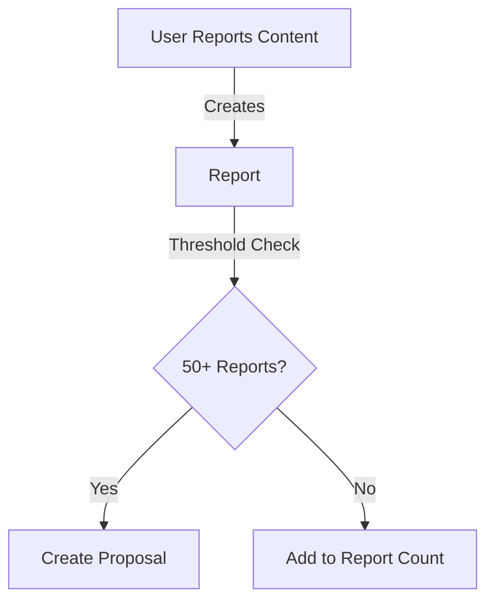
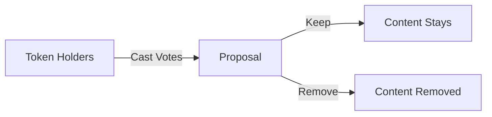
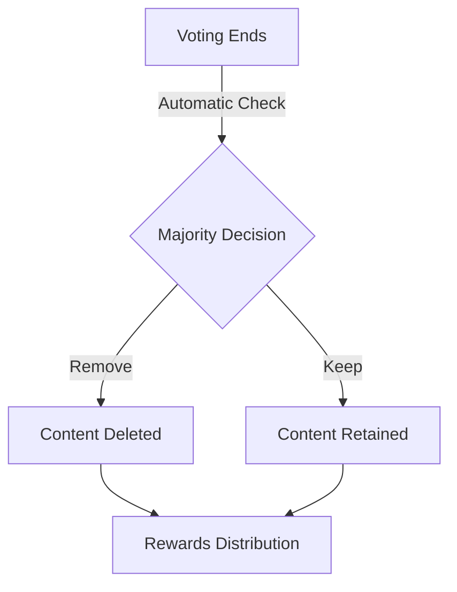

# DAO-Based Content Moderation System

## Overview
SolMeme implements a decentralized autonomous organization (DAO) for community-driven content moderation. This system ensures transparent, fair, and decentralized decision-making for content moderation.

## System Architecture

### Smart Contract Components
1. **Governance Token**
   - Name: SMOD (SolMeme Moderation)
   - Purpose: Voting rights in moderation decisions
   - Distribution: Earned through active participation

2. **Moderation DAO Contract**
   - Handles proposal creation
   - Manages voting process
   - Executes moderation decisions

## Moderation Flow

### 1. Report Submission


1. User identifies inappropriate content
2. Submits report with reason
3. Report is recorded on-chain
4. System checks report threshold

### 2. Proposal Creation
When content receives 50+ reports:
1. Automatic proposal creation
2. 24-hour voting period starts
3. Notification to token holders
4. Content flagged as "Under Review"

### 3. Voting Process


- Each SMOD token = 1 vote
- Options: Remove or Keep content
- Voting period: 24 hours
- Simple majority decides outcome

### 4. Decision Execution


1. Automatic execution after voting period
2. Decision implemented on-chain
3. Rewards distributed to participants
4. Results recorded for transparency

## Smart Contract Implementation

### Proposal Structure
```solidity
struct Proposal {
    string id;
    string postId;
    uint256 reportCount;
    mapping(address => Vote) votes;
    uint256 removeVotes;
    uint256 keepVotes;
    ProposalStatus status;
    uint256 deadline;
}

enum ProposalStatus {
    Active,
    Executed,
    Rejected
}
```

### Voting Logic
```typescript
async function vote(proposalId: string, vote: 'remove' | 'keep'): Promise<boolean> {
    // Verify voter has governance tokens
    const balance = await getGovernanceTokenBalance();
    if (balance <= 0) throw new Error('No governance tokens');

    // Submit vote
    const proposal = await getProposal(proposalId);
    if (proposal.status !== 'active' || Date.now() > proposal.deadline) {
        throw new Error('Voting period ended');
    }

    // Record vote
    await recordVote(proposalId, vote);

    // Check if proposal should be executed
    await checkAndExecuteProposal(proposalId);

    return true;
}
```

## Reward System

### Token Distribution
1. **Report Validation**
   - Correct reports (leading to removal): 5 SMOD
   - False reports: -2 SMOD

2. **Voting Participation**
   - Voting with majority: 2 SMOD
   - Active participation streak: Bonus multiplier

3. **Moderation Quality**
   - Consistent correct votes: Reputation increase
   - Higher reputation = Higher voting power

## Security Measures

### 1. Sybil Resistance
- Minimum token stake required for voting
- Cool-down period between votes
- Reputation system

### 2. Vote Manipulation Prevention
- One vote per address per proposal
- Token lock during voting period
- Transparent vote counting

### 3. Spam Protection
- Report cooldown period
- Minimum account age requirement
- Stake requirement for reporting

## Integration Example

### Report Content
```typescript
async function reportContent(postId: string, reason: string): Promise<boolean> {
    try {
        // Add report to chain
        const report = {
            postId,
            reporter: publicKey.toString(),
            reason,
            timestamp: Date.now(),
        };

        // Check report threshold
        const reportCount = await getReportCount(postId);
        
        if (reportCount >= 50) {
            await createProposal(postId);
        }

        return true;
    } catch (error) {
        console.error('Error reporting content:', error);
        return false;
    }
}
```

### Cast Vote
```typescript
async function castVote(proposalId: string, vote: 'remove' | 'keep'): Promise<boolean> {
    try {
        // Verify voter eligibility
        const balance = await getGovernanceTokenBalance();
        if (balance <= 0) {
            throw new Error('No governance tokens');
        }

        // Submit vote
        await submitVote(proposalId, vote);

        // Check execution
        await checkAndExecuteProposal(proposalId);

        return true;
    } catch (error) {
        console.error('Error voting:', error);
        return false;
    }
}
```

## Best Practices

### For Users
1. **Reporting Content**
   - Provide clear reason
   - Include evidence
   - Be objective in assessment

2. **Voting**
   - Review content carefully
   - Consider community guidelines
   - Vote within deadline

### For Developers
1. **Implementation**
   - Regular security audits
   - Performance optimization
   - Clear error handling

2. **Monitoring**
   - Track voting patterns
   - Monitor token distribution
   - Analyze moderation effectiveness

## Dashboard Metrics

### 1. Moderation Statistics
- Active proposals
- Resolution rate
- Average voting participation
- Token distribution

### 2. User Metrics
- Reputation scores
- Voting accuracy
- Token balance
- Participation rate

## Future Improvements

### 1. Planned Features
- Weighted voting based on reputation
- Advanced spam detection
- Appeals process
- Multi-signature execution

### 2. Scalability
- Layer 2 integration
- Optimistic rollups
- State channel implementation

## Conclusion
The DAO-based moderation system ensures:
- Decentralized decision-making
- Community involvement
- Transparent processes
- Fair content moderation

For technical support or feature requests, please refer to our GitHub repository or join our Discord community.
